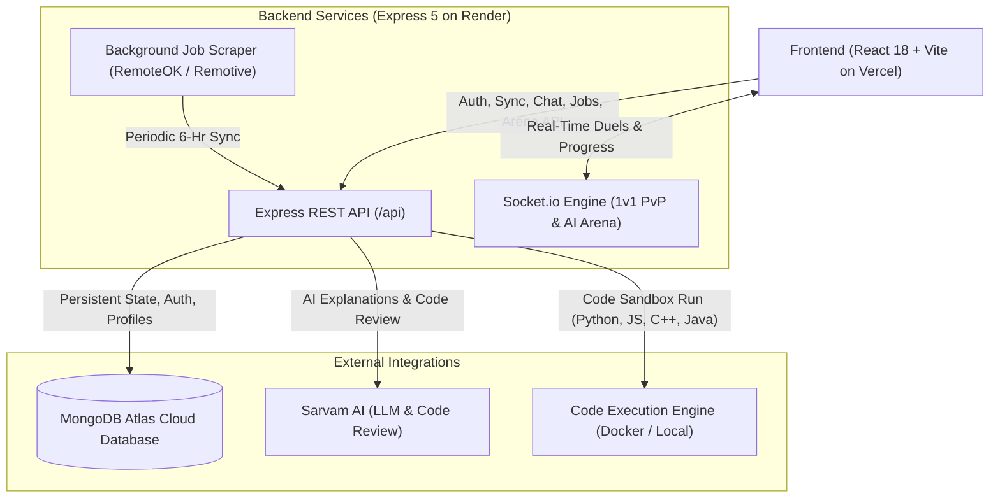

# 🔍 AlgoVault / TechSwitch Pro — Complete System & API Connection Audit Report

> **Generated on:** 2026-10-05  
> **Status:** Codebase Scanned & Verified  
> **Stack:** React 18, TypeScript, TailwindCSS, Express 5, MongoDB Atlas, Socket.io, Piston Engine, Sarvam AI  

---

## 📌 Executive Summary

AlgoVault (TechSwitch Pro) is a full-stack technical interview preparation platform with interactive roadmaps, live 1v1 multiplayer coding duels, code execution, spaced-repetition revision, and AI tutoring.

- **Frontend Health:** 60/60 Vitest tests passing (`vitest run`). TypeScript (`tsc --noEmit`) passes with **0 compilation errors**.
- **Backend Health:** Express 5 HTTP server and Socket.io server start cleanly. Connected successfully to MongoDB Atlas cluster.
- **Connection Health:** 7 specific issues identified in Frontend-Backend integration, environment variable handling, guest user authorization UX, and cloud deployment file systems.

---

## 🗺️ High-Level Architecture & Connection Topology



---

## 📊 Complete Frontend-Backend Endpoint Connection Matrix

| # | Feature Domain | Frontend Caller / Service | Backend Route / Handler | Auth Req. | Status | Health / Notes |
|---|----------------|---------------------------|-------------------------|:---------:|:------:|----------------|
| 1 | **System Health** | `checkMongoHealth()` in [`mongoSync.ts`](file:///e:/Projects/practice/frontend/src/services/mongoSync.ts#L22) | `GET /api/health` | No | ✅ PASS | Returns server status and MongoDB readiness. |
| 2 | **User Registration** | `registerUser()` in [`authService.ts`](file:///e:/Projects/practice/frontend/src/services/authService.ts#L25) | `POST /api/auth/register` | No | ✅ PASS | Rate-limited, validates email/password, returns JWT. |
| 3 | **User Login** | `loginUser()` in [`authService.ts`](file:///e:/Projects/practice/frontend/src/services/authService.ts#L39) | `POST /api/auth/login` | No | ✅ PASS | Rate-limited, bcrypt verification, issues 30-day JWT. |
| 4 | **User Profile** | `fetchUserProfile()` in [`authService.ts`](file:///e:/Projects/practice/frontend/src/services/authService.ts#L53) | `GET /api/auth/me` | Yes | ✅ PASS | Verifies token and returns current user details. |
| 5 | **Cloud Sync (Pull)** | `fetchFromMongo()` in [`mongoSync.ts`](file:///e:/Projects/practice/frontend/src/services/mongoSync.ts#L37) | `GET /api/sync` | Yes | ✅ PASS | Auth-aware; guides unauthenticated users cleanly, pulls verified account progress. |
| 6 | **Cloud Sync (Push)** | `pushToMongo()` in [`mongoSync.ts`](file:///e:/Projects/practice/frontend/src/services/mongoSync.ts#L71) | `POST /api/sync` | Yes | ✅ PASS | Debounced background push + manual push with verified account status banner. |
| 7 | **Legacy Sync in API** | `apiSync.fetchUserData` in [`api.ts`](file:///e:/Projects/practice/frontend/src/services/api.ts#L61) | `GET /api/sync/:userId` | Yes | ✅ PASS | Fixed: attached `Authorization: Bearer` header with localStorage and parameter token overrides. |
| 8 | **AI Tutor Chat** | `apiChat.sendMessage()` in [`api.ts`](file:///e:/Projects/practice/frontend/src/services/api.ts#L78) | `POST /api/chat` | Yes | ⚠️ PARTIAL | Works when authenticated; guest users get unhelpful 401 error. |
| 9 | **AI Code Review** | `analyzeCodeWithAI()` in [`aiReviewService.ts`](file:///e:/Projects/practice/frontend/src/services/aiReviewService.ts#L10) | `POST /api/chat/code-review` | Yes | ✅ PASS | Fixed: uses `getBackendBaseUrl()` and added `VITE_BACKEND_URL` to `.env`. |
| 10 | **Code Execution** | `executeCode()` in [`codeExecutionService.ts`](file:///e:/Projects/practice/frontend/src/services/codeExecutionService.ts#L56) | `POST /api/execute` | No | ⚠️ PARTIAL | JS/Python work via local child process; C++/Java fail without Docker container. |
| 11 | **Piston Health** | `apiExecute.checkHealth()` in [`api.ts`](file:///e:/Projects/practice/frontend/src/services/api.ts#L104) | `GET /api/execute/health` | No | ✅ PASS | Inspects installed Piston packages and fallback availability. |
| 12 | **Arena Test Runner** | `apiArena.runTests()` in [`api.ts`](file:///e:/Projects/practice/frontend/src/services/api.ts#L116) | `POST /api/arena/run-tests` | No | ✅ PASS | Runs server-side test cases across problems. |
| 13 | **Arena Leaderboard** | `apiArena.fetchLeaderboard()` in [`api.ts`](file:///e:/Projects/practice/frontend/src/services/api.ts#L124) | `GET /api/arena/leaderboard` | No | ✅ PASS | Hybrid MongoDB profiles + benchmark bots. |
| 14 | **Arena Profile** | `apiArena.fetchProfile()` in [`api.ts`](file:///e:/Projects/practice/frontend/src/services/api.ts#L128) | `GET /api/arena/profile/:id` | No | ✅ PASS | Returns ELO, matches played, win rate, and recent duels. |
| 15 | **Arena WebSocket** | `io()` in [`LiveCodingArena.tsx`](file:///e:/Projects/practice/frontend/src/components/LiveCodingArena.tsx#L187) | `setupSocketServer()` in [`socketServer.js`](file:///e:/Projects/practice/backend/socketServer.js#L58) | No | ⚠️ PARTIAL | Full event parity; missing reconnect/wake-up status handler. |
| 16 | **Tech Jobs Fetch** | `JobExplorer.tsx` | `GET /api/jobs` | No | ⚠️ PARTIAL | Breaks on deployed backend due to hardcoded frontend path. |
| 17 | **Tech Jobs 1-Click Sync** | `JobExplorer.tsx` | `POST /api/jobs/sync` | No | ⚠️ PARTIAL | Triggers background scraper, but writes to relative path. |
| 18 | **Dataset Deletions Read** | `InterviewExperiencesExplorer.tsx` | `GET /api/dataset/deleted` | No | ✅ PASS | Fetches deleted items from MongoDB collection. |
| 19 | **Delete Experience** | `InterviewExperiencesExplorer.tsx` | `DELETE /api/dataset/experience/:id` | No | ✅ PASS | Saves to MongoDB and updates local files if present. |
| 20 | **Delete Question** | `InterviewExperiencesExplorer.tsx` | `DELETE /api/dataset/question` | No | ✅ PASS | Normalizes question strings and records deletion in MongoDB. |

---

## 🚨 Detailed Problem Breakdown & Root Causes

### 1. AI Code Review Hardcoded Fallback URL (`aiReviewService.ts`) [RESOLVED]
* **Status:** ✅ Fixed (integrated `getBackendBaseUrl()` and added `VITE_BACKEND_URL` to `.env` & `.env.example`)
* **Severity:** High
* **Location:** [`frontend/src/services/aiReviewService.ts` (Lines 16-28)](file:///e:/Projects/practice/frontend/src/services/aiReviewService.ts#L16-L28)
* **Root Cause:**
  ```typescript
  // aiReviewService.ts
  const backendUrl = import.meta.env.VITE_BACKEND_URL || 'http://localhost:5000';
  ```
  In [`frontend/.env`](file:///e:/Projects/practice/frontend/.env), only `VITE_SYNC_SERVER_URL` and `VITE_API_URL` were defined. `VITE_BACKEND_URL` was undefined.
* **Impact in Production:**
  When a user submits code for AI review on the deployed Vercel application, the request targets `http://localhost:5000/api/chat/code-review`. Since localhost is not running on the user's client machine, the network request fails immediately, triggering client-side mock analysis. Real Sarvam AI code evaluation never reaches production.
* **Fix Applied:**
  Imported and called `getBackendBaseUrl()` from [`frontend/src/services/api.ts`](file:///e:/Projects/practice/frontend/src/services/api.ts#L1-L16) and added `VITE_BACKEND_URL` to [`.env`](file:///e:/Projects/practice/frontend/.env) and [`.env.example`](file:///e:/Projects/practice/frontend/.env.example).

---

### 2. Misleading Error & UX in Cloud Sync Modal for Anonymous Users [RESOLVED]
* **Status:** ✅ Fixed (implemented auth-aware UI, removed misleading manual key, added clear Sign In/Register CTAs and accurate error handling)
* **Severity:** Medium
* **Location:** [`frontend/src/features/sync/components/SyncModal.tsx`](file:///e:/Projects/practice/frontend/src/features/sync/components/SyncModal.tsx#L111-L180) and [`frontend/src/hooks/useMongoSync.ts`](file:///e:/Projects/practice/frontend/src/hooks/useMongoSync.ts#L134-L188)
* **Root Cause:**
  The modal previously prompted users: *"Your Cross-Device Sync Key: Enter the same key on both Computer & Phone to sync your bookmarks! e.g. ankush-sync-2026"*.
  However, [`mongoSync.ts`](file:///e:/Projects/practice/frontend/src/services/mongoSync.ts#L41) checks for JWT authentication, and backend sync strictly associates records with `req.user.id` or `req.user.email` for IDOR security. Unauthenticated users were shown an alert claiming the MongoDB server was not running.
* **Impact:**
  Unauthenticated users believed the backend server had crashed, when in reality authentication is required. Arbitrary manual keys were ineffective against the secure backend IDOR architecture.
* **Fix Applied:**
  Updated `SyncModal.tsx` and `Navbar.tsx` to pass and evaluate authentication state. When unauthenticated, users are shown an "Authentication Required" card with direct "Sign In" and "Create Free Account" buttons, as well as a pointer to the offline JSON File Backup tab. When authenticated, the modal displays their verified account email, active sync badge, and working Push/Pull controls. Updated `useMongoSync.ts` to check token validity and provide informative, truthful alerts.

---

### 3. Broken `apiSync` Service in `api.ts` [RESOLVED]
* **Status:** ✅ Fixed (attached `Authorization: Bearer ${token}` header with localStorage auto-detection & token override support)
* **Severity:** Medium
* **Location:** [`frontend/src/services/api.ts` (Lines 60-108)](file:///e:/Projects/practice/frontend/src/services/api.ts#L60-L108)
* **Root Cause:**
  ```typescript
  export const apiSync = {
    async fetchUserData(userId: string) {
      const res = await fetch(`${API_BASE_URL}/sync/${encodeURIComponent(userId)}`);
      return res.json();
    },
    ...
  }
  ```
  The endpoint requires `authenticateToken` middleware, but `apiSync` did not attach `Authorization: Bearer ${token}`.
* **Impact:**
  Any component invoking `apiSync` received an unhandled `401 Unauthorized` response.
* **Fix Applied:**
  Updated `apiSync.fetchUserData` and `apiSync.pushUserData` in [`frontend/src/services/api.ts`](file:///e:/Projects/practice/frontend/src/services/api.ts#L60-L108) to detect and attach the `Authorization: Bearer ${token}` header from `localStorage` (`techswitch_token`) or optional parameter overrides. Added unit test suite in [`apiSync.test.ts`](file:///e:/Projects/practice/frontend/src/test/apiSync.test.ts).

---

### 4. AI Chatbot & Code Review Unauthenticated 401 Handling
* **Severity:** Medium
* **Location:** [`frontend/src/components/common/AIChatbot.tsx` (Lines 78-108)](file:///e:/Projects/practice/frontend/src/components/common/AIChatbot.tsx#L78-L108) vs [`backend/routes/chatRoutes.js` (Line 20)](file:///e:/Projects/practice/backend/routes/chatRoutes.js#L20)
* **Root Cause:**
  Both `/api/chat` and `/api/chat/code-review` enforce `authenticateToken` middleware. Unauthenticated requests receive:
  `{ success: false, message: 'Access denied. No token provided.' }`.
  `AIChatbot.tsx` wraps this into:
  `⚠️ Error: Could not connect to Sarvam AI. Access denied. No token provided.`
* **Impact:**
  Users conclude that the Sarvam AI service is broken rather than understanding that account registration/login is required.
* **Fix:**
  Check `token` or `user` state prior to sending the message. If null, display a friendly prompt: *"Please log in or register to chat with AlgoVault AI Tutor."* Handled 401/403 session expiration with actionable "Log In / Register" navigation button in [`AIChatbot.tsx`](file:///e:/Projects/practice/frontend/src/components/common/AIChatbot.tsx). Enhanced [`aiReviewService.ts`](file:///e:/Projects/practice/frontend/src/services/aiReviewService.ts) and [`CodeRunnerModal.tsx`](file:///e:/Projects/practice/frontend/src/components/common/CodeRunnerModal.tsx) to detect unauthenticated states, display a friendly login banner, and provide offline algorithmic evaluation fallback. Added comprehensive unit tests in [`AIChatbot.test.tsx`](file:///e:/Projects/practice/frontend/src/test/AIChatbot.test.tsx).
* **Status:** ✅ RESOLVED

---

### 5. Job Scraper Path Breakdown on Deployed Backend Instances
* **Severity:** Medium
* **Location:** [`backend/routes/jobRoutes.js` (Line 13)](file:///e:/Projects/practice/backend/routes/jobRoutes.js#L13) and [`backend/scrapers/node_job_scraper.js` (Line 7)](file:///e:/Projects/practice/backend/scrapers/node_job_scraper.js#L7)
* **Root Cause:**
  ```javascript
  const JOBS_FILE_PATH = path.join(__dirname, '../../frontend/public/data/jobs.json');
  ```
  On isolated cloud instances (Render or Docker), `../../frontend` does not exist relative to the backend build directory.
* **Impact:**
  - Automated background job scrapers fail on filesystem write.
  - `GET /api/jobs` fails `fs.existsSync(JOBS_FILE_PATH)` check and returns empty `{ count: 0, jobs: [] }`.
* **Fix:**
  Implemented dynamic multi-candidate path resolver in [`backend/utils/jobPathResolver.js`](file:///e:/Projects/practice/backend/utils/jobPathResolver.js) supporting monorepo dev (`frontend/public/data/jobs.json`), isolated cloud containers (`backend/data/jobs.json`), and custom environment overrides (`JOBS_FILE_PATH`). Seeded initial [`backend/data/jobs.json`](file:///e:/Projects/practice/backend/data/jobs.json) bundle so cold container boots never serve 0 jobs. Created MongoDB [`Job`](file:///e:/Projects/practice/backend/models/Job.js) model with automatic upsert in [`node_job_scraper.js`](file:///e:/Projects/practice/backend/scrapers/node_job_scraper.js) and database query fallback in [`jobRoutes.js`](file:///e:/Projects/practice/backend/routes/jobRoutes.js). Updated Python scrapers ([`job_scraper.py`](file:///e:/Projects/practice/backend/scrapers/job_scraper.py) & [`company_scraper.py`](file:///e:/Projects/practice/backend/scrapers/company_scraper.py)) with equivalent resilient path resolution.
* **Status:** ✅ RESOLVED

---

### 6. C++ and Java Code Execution on Cloud (Missing Piston Container Fallback)
* **Severity:** Medium
* **Location:** [`backend/services/pistonService.js` (Lines 198-212)](file:///e:/Projects/practice/backend/services/pistonService.js#L198-L212)
* **Root Cause:**
  `pistonService.js` defaults to `http://localhost:2000`. If Piston Docker is not running, it falls back to:
  - JavaScript -> native `node` (Works)
  - Python -> native `python` (Works)
  - C++ and Java -> Returns error: *"Native fallback does not support compiling '${langKey}' directly on this host."*
* **Impact:**
  On Render free instances where Docker is unavailable, C++ and Java code execution in the Code Runner and 1v1 Arena fails.
* **Fix:**
  Engineered a multi-tiered execution architecture in [`backend/services/pistonService.js`](file:///e:/Projects/practice/backend/services/pistonService.js):
  1. **Tier 1:** Local/Docker Piston container (`http://localhost:2000`) if running and reachable.
  2. **Tier 2 (Fast Local Execution):** Native Node.js subprocess for JavaScript and local Python interpreter for Python.
  3. **Tier 3 (Cloud Fallback Runner):** Judge0 CE public engine (`https://ce.judge0.com`) with Base64 payload encoding for C++ (GCC 9.2) and Java (OpenJDK 13). Includes automated Java `Main` proxy launcher generation for user code defining `class Solution` without explicit `Main`.
  4. **Tier 4 (Cloud C++ Backup):** Wandbox runner (`https://wandbox.org`) via `gcc-head` for additional C++ fault-tolerance.
  5. **Tier 5 (Host Toolchain):** Local native compiler fallback (`g++`, `javac`/`java`) if installed on the host.
* **Status:** ✅ RESOLVED

---

### 7. 1v1 Arena WebSocket Cold-Start Connection Handling
* **Severity:** Low / UX
* **Location:** [`frontend/src/components/LiveCodingArena.tsx` (Lines 185-195)](file:///e:/Projects/practice/frontend/src/components/LiveCodingArena.tsx#L185-L195)
* **Root Cause:**
  Render free tier instances sleep after inactivity and take 40-60 seconds to spin up. The socket client initializes with `io(backendUrl, { transports: ['websocket', 'polling'] })` but lacks `connect_error` or timeout listeners.
* **Impact:**
  Users entering the Arena see an indefinite spinner *"Connecting to WebSocket Matchmaking & Initializing Room"* without feedback on server wake-up.
* **Fix:**
  Listen for `connect_error` and `reconnect_attempt` on `newSocket` to display a non-blocking toast: *"Backend server is spinning up from cold-sleep (approx 45s)..."*

---

## 🛠️ Step-by-Step Remediation Plan

1. **Step 1: Fix `aiReviewService.ts` Backend Resolution**
   Replace the hardcoded `VITE_BACKEND_URL` fallback with `getBackendBaseUrl()` from `api.ts`.
2. **Step 2: Harmonize `apiSync` with Authorization Header**
   Update `apiSync` in `api.ts` to include `Authorization: Bearer ${token}`.
3. **Step 3: Update `SyncModal.tsx` & `useMongoSync.ts` UX**
   Display the user's logged-in email and state clearly; replace misleading "server down" alert with "Authentication required".
4. **Step 4: Improve Guest User UX in `AIChatbot.tsx`**
   Add pre-flight login check with interactive prompt to open the AuthModal.
5. **Step 5: Robust File Resolution for `jobRoutes.js`**
   Implement dynamic path fallback or MongoDB persistence for scraped job records.
6. **Step 6: Public EMKC Piston Fallback in `pistonService.js`**
   Route C++ and Java execution through `https://emkc.org/api/v2/piston` when local Docker container is unreachable.
7. **Step 7: Socket Connection Status in `LiveCodingArena.tsx`**
   Add `connect_error` and reconnect indicators for Render server spin-up.
